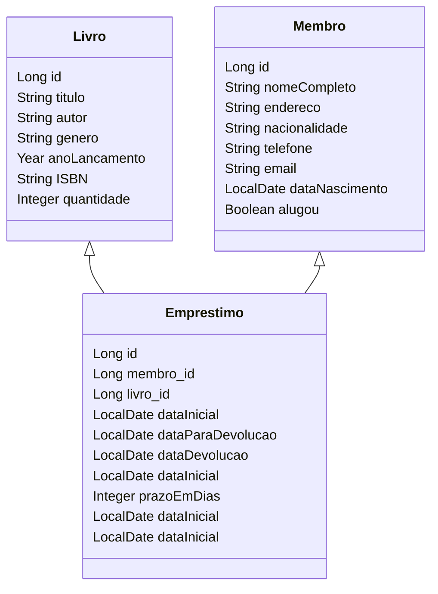

## PROJETO FINAL - BIBLIOTECA

## Disciplina: WEB II (Ser+ Tech Programa 50+ Turma #1076)
### Professor: Alex Facincani

- **Deyse Ribeiro**
- **Dirce Mitiko Taira**
- **Gerson Camillo**

### Tecnologia:
* Java 20
* SpringBoot 3.2.3
* PostgreSql 16.2
* IntelliJ IDEA 2023.2.2 (Community Edition)
* pgAdmin4 7.8
* Postman

### DESCRIÇÃO DO PROJETO:
Este projeto visa desenvolver um sistema que gerencie uma biblioteca que faz empréstimos de livros aos seus membros. 

O sistema foi desenvolvido para conter 3 Bancos de Dados PostGreSQL para Gestão de Livros, Membros e de Empréstimos.

Cada um dos livros catalogados  possui atributos, como: título, autor, gênero, ano de lançamento, Codigo ISBN e quantidade.

Cada membro da Biblioteca possui atributos como: nome completo, endereço, email, telefone, data de nascimento e uma chave se tem algum livro emprestado.

Implementar uma aplicação para abranger:

- cadastrar, alterar, consultar e excluir livros
- cadastrar, alterar, consultar e excluir membros
- incluir, alterar, consultar e concluir empréstimos de livros para os membros, calculando a data de devolução e cobrando multa no caso de atraso na data da devolução.

**OBSERVAÇÕES**:

- É necessário que se utilize os conceitos de Spring Boot e utilização de Banco de Dados.
- O projeto será desenvolvido em grupos de até 4 integrantes
- A entrega será feita via repositório GIT.

## Diagrama de classes básico do projeto

### Estrutura de Dados
Foram desenvolvidas as classes Livro, Membro, Emprestimo

# Alguns comandos básicos em GIT para este projeto

(https://github.com/glcamillo) no GitHub e foram incluídos os seguintes colaaboradores:
1. Deyse Ribeiro
2. Gerson Camillo

Num primeiro momento, o projeto deve ser trazido para a máquina pessoal de cada participante via:
`git clone https://github.com/glcamillo/poo-projeto-catalogo-imdb.git`

a) Antes de iniciar qualquer alteração/inclusão de código, atualizar o repositório LOCAL com o comando a seguir:

`git pull`

Observações:
- Comandos considerando que o projeto já tenha sido clonado para a máquina local;
- Todos os comandos devem ser executados no diretório do projeto. Ao abrir no IntelliJ, ele já abre o terminal no diretório corrente do projeto.

b) Os próximos comandos são opcionais, apenas para "conhecer" melhor o que está acontecendo:

`git status`

`git log` Teclar 'q' para sair

`git branch` ou `git branch -a` ou `git branch -r`

c) Este comando faz o git ir para "nossa área de trabalho local" (**Working Directory**), ou seja, a `branch` na qual será realizado todo o trabalho. Durante o `push`, as alterações irão para esta linha (branch) no repositório remoto. A `branch` **main** só receberá as alterações depois de um `merge`que será acionado por um `pull request`.

`git checkout minha-branch-de-trabalho`

Ou, se ***ainda não tiver criado sua branch*** então deve ser executado o seguinte comando. Ele cria uma nova branch local e ela já se torna a branch de trabalho atual.

`git checkout -b minha-branch-de-trabalho`

d) Depois de codificados/alterados os arquivos, deve-se adicionar os mesmos na **Staging Area (Index)** que faz com que o git fique cientificado dessas alterações.

`git add meu-arquivo.java` ou `git add .` Aqui adiciona todas as alterações do diretório corrente.

e) Da área de **Index** para o seu repositório local (**repository**):

`git commit -m "Mensagem informando o que foi feito"`

f) O diretório local está sincronizado quanto às alterações. Agora é a hora de levar essas alterações para o diretório remoto do projeto no GitHub.

`git push` Pode não funcionar, então, um comando mais específico seria:

`git push -u origin minha-branch-de-trabalho`  (`-u`é  sinônimo para `--set-upstream` e **origin** é o nome do remoto)

**Importante** A branch `minha-branch-de-trabalho` no remoto `origin` (GitHub) está atualizada. Entra o trabalho de **merge** no qual as alterações serão incorporadas na linha principal (`main`).

g) **Mais importante ainda:** nesta fase do trabalho em que estamos trabalhando nos mesmos códigos, é importante trazer as alterações mais recentes da branch `main` para a nossa brainch local de trabalho `minha-branch-de-trabalho` (isso poderia também ser feito no GitHub). A sequência de comandos é a seguinte:

`git checkout main` Indo pro branch da linha principal.

`git pull` Sincronizando (trazendo as alterações) mais recentes do remoto `origin`.

`git chechout minha-branch-de-trabalho` Indo pra branch local.

`git pull` Sincronizando a branch local.

E, agora, o comando que vai atualizar a branch `minha-branch-de-trabalho` com as alterações da linha `main`.

`git merge main`

E, depois, voltar para a branch de trabalho.

