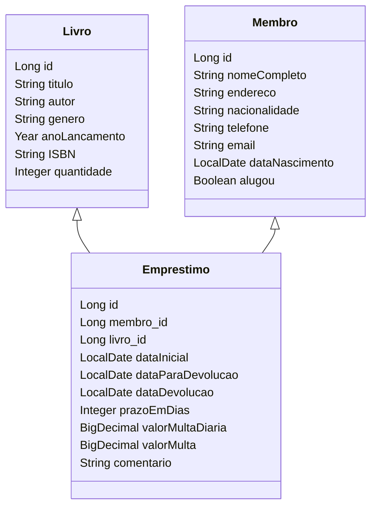

## PROJETO FINAL - BIBLIOTECA

## Disciplina: WEB II (Ser+ Tech Programa 50+ Turma #1076)
### Professor: Alex Facincani

- **Deyse Ribeiro**
- **Dirce Mitiko Taira**
- **Gerson Camillo**

### Tecnologia:
* Java 20
* SpringBoot 3.2.3
* PostgreSql 16.2
* IntelliJ IDEA 2023.2.2 (Community Edition)
* pgAdmin4 7.8
* Postman

### DESCRIÇÃO DO PROJETO:
Este projeto visa desenvolver um sistema que gerencie uma biblioteca que faz empréstimos de livros aos seus membros. 

O sistema foi desenvolvido para conter 3 Bancos de Dados PostGreSQL para Gestão de Livros, Membros e de Empréstimos.

Cada um dos livros catalogados  possui atributos, como: título, autor, gênero, ano de lançamento, Codigo ISBN e quantidade.

Cada membro da Biblioteca possui atributos como: nome completo, endereço, email, telefone, data de nascimento e uma chave se tem algum livro emprestado.

Implementar uma aplicação para abranger:

- cadastrar, alterar, consultar e excluir livros
- cadastrar, alterar, consultar e excluir membros
- incluir, alterar, consultar e concluir empréstimos de livros para os membros, calculando a data de devolução e cobrando multa no caso de atraso na data da devolução.

**OBSERVAÇÕES**:

- É necessário que se utilize os conceitos de Spring Boot e utilização de Banco de Dados.
- O projeto será desenvolvido em grupos de até 4 integrantes
- A entrega será feita via repositório GIT.

## Diagrama de classes básico do projeto

### Estrutura de Dados
Foram desenvolvidas as classes Livro, Membro, Emprestimo

# Alguns comandos para testes dos Bancos de Dados

Utilizamos o Postman e pgAdmin para verificações nos bancos de dados.

Os seguintes bancos de dados foram criados, com as respectivas funcionalidades:
- livrodb
  - GET localhost:8080/livros  - para listar todos os livros
  - GET localhost:8080/livros/id - para listar um id especifico
  - POST localhost:8080/livros   - para incluir novos livros
      
    - Exemplo de JSON:

    {

              "titulo": "Iracema",
              "autor": "Jose de Alencar",
              "genero": "literatura brasileira",
              "anoLancamento": "1950",
              "isbn": "ISBN 978–85–333–0227–3 ",
              "quantidade": 1

            }
  
    - PUT localhost:8080/livros/id   - para alteras campos de livros
      - Exemplo de JSON:

    {

              "titulo": "Iracema",
              "autor": "Jose de Alencar",
              "genero": "literatura brasileira",
              "anoLancamento": "1950",
              "isbn": "ISBN 978–85–333–0227–3 ",
              "quantidade": 1

            }
  
  - membrosdb
    - GET localhost:8080/membros  - para listar todos os membros
    - GET localhost:8080/membros/id - para listar um membro especifico
    - POST localhost:8080/membros   - para incluir novos membros (é feita checagem de emails duplicados)
      - Exemplo de JSON:
    
{

          "nomeCompleto": "Dirce Yumi Kita",
          "endereco": "Rua Afonso Pena, xxx",
          "nacionalidade": "brasileira",
          "email": "a.b@gmail.com",
          "telefone": "(11)99999-5428",
          "dataNascimento": "2000-05-16",
          "alugou": false

}
-   PUT localhost:8080/membros/id   - para alterar campos dos membros
    - Exemplo de JSON:

  {

          "nomeCompleto": "Julia Taira",
          "endereco": "Rua Afonso Pena, 999",
          "nacionalidade": "brasileira",
          "email": "julia.taira@gmail.com",
          "telefone": "(11)99918-5555",
          "dataNascimento": "1999-05-16",
          "alugou": false

}
- emprestimosdb 
  - GET localhost:8080/emprestimos  - para listar todos os emprestimos
  - GET localhost:8080/emprestimos/id - para listar um emprestimo especifico
  - POST localhost:8080/emprestimos   - para incluir novos emprestimos 
      - Exemplo de JSON:

{

            "membro_id": 5,
            "livro_id": 8,
            "dataInicial": "2024-03-10",
            "dataParaDevolucao": null,
            "dataDevolucao": null,
            "prazoEmDias": 3,
            "valorMulta": null,
            "comentario": null,
            "multaDiaria": 3.00",
            "comentario":"cadastrando emprestimo"

}
    
- PUT   localhost:8080/emprestimos/devolver/id   - para incluir novos emprestimos
    - Exemplo de JSON:

{

            "membro_id": 5,
            "livro_id": 8,
            "dataDevolucao": "2024-03-10",
            "prazoEmDias": 3,
            "valorMulta": null,
            "comentario": null,
            "multaDiaria": 3.00",
            "comentario":"devolvendo emprestimo"

}

